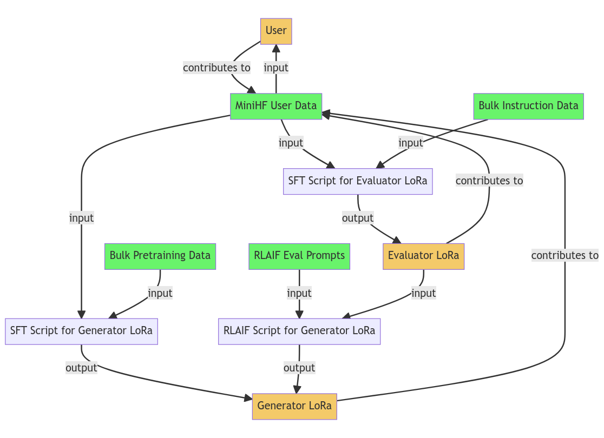

MiniHF is an inference, human preference data collection, and fine-tuning tool
for local language models. It is intended to help the user develop their prompts
into full models. Normally when we prompt a language model we're forced to think
in that models latent space. MiniHF lets you go the other direction: Imagine the
ideal context in which your prompt could take place and then add it to the model.
To make this possible MiniHF provides several powerful features:

* Lightweight web interface and inference server that lets you easily branch your
session with the model into multiple completion chains and pick the best ones

* A monte carlo tree search (MCTS) based inference algorithm, Weave, which rejection
samples from the model to improve output quality

* The ability to finetune both the underlying generator LoRa and the evaluator
reward LoRa used for the tree search on your own custom dataset

* Easy bootstrapping of new document contexts and models using reinforcement
learning from AI feedback (RLAIF)

* Easy install with minimal dependencies

## Features

- **Human Feedback**: Make your own feedback dataset by writing with local
language models such as StableLM and NeoX 20b.

- **Train A Reward Head**: Use your dataset to train a reward head on text embeddings.
The reward head allows you to automatically give your opinion on pieces of text.

- **AutoLoom**: Use your reward head to search over many possible completions
in the vein of [Janus's loom](https://generative.ink/posts/loom-interface-to-the-multiverse/).
The user does not have to manage the tree themselves, MiniHF's weave algorithm
does it for you. Simply pick a canonical entry from the top k nodes found by weave.

## Setup

### DataCrunch

If you want to use MiniHF with a large amount of VRAM, https://datacrunch.io/ is
a good option. Provision an A6000, A6000 Ada, etc from their selection with
the `Ubuntu + Cuda + Docker` image and more than the default amount of storage
(I found it worked with 1tb, but you can probably make do with less, **the default
40gb is not enough**). Once you have it running SSH in with a listener on port 5000:

```
ssh root@IP_ADDRESS -L 5000:localhost:5000
```

Once you're in clone the repo and change directories to it:

```
git clone https://github.com/JD-P/minihf.git
cd minihf
git checkout eval
```

Then run:

```
bash setup.sh
```

You should see the script update the server packages, install python dependencies
from pip, download the models, and then finally start the inference server. At
this point you can start using MiniHF by visiting http://localhost:5000/ in your
browser. You can change which models you're using in the `minihf_infer.py` file.
Later on we'll add a configuration file to change these settings.

To start the server yourself on subsequent logins use the commands:

```
cd minihf
source env_minihf/bin/activate
flask --app minihf_infer run
```

## Tuning Models

MiniHF lets you tune two model types, both of which are LoRa tunes on an underlying
foundation model such as [GPT-J](https://huggingface.co/EleutherAI/gpt-j-6b),
[NeoX](https://github.com/EleutherAI/gpt-neox),
[OpenLlama](https://huggingface.co/openlm-research/open_llama_7b_v2), or [falcon-40b](https://huggingface.co/tiiuae/falcon-40b):

1. **Generator LoRa** - Generates the text that the user or Weave algorithm evaluates.

2. **Evaluator LoRa** - Reward model that selects between branches in the Weave tree search. 

Furthermore each model has two kinds of tuning, self-supervised finetuning (SFT) and
reinforcement learning from AI feedback (RLAIF).



### Preparing The Tuning Dataset

The tuning dataset should consist of a zip file containing one or more plaintext
files or json conversations exported from MiniHF. Because the model might not be
adapted to your style or document context yet, it might be more efficient to write
out the first drafts of what you want in text files and then start using MiniHF
after you've tuned the generator on them.

### Tuning The Generator

Once you have the tuning dataset it's easy to make a generator LoRa from it with
the `sft_generator.py` script:

```
python3 sft_generator.py --user-dataset data.zip --model "EleutherAI/gpt-j-6b" --output example
```

Keep in mind that if your data is under 10 megabytes of tokens or so, other bulk
pretraining data [from the RedPajama
dataset](https://huggingface.co/datasets/togethercomputer/RedPajama-Data-1T-Sample)
will be used to prevent overfitting.

### Tuning The Evaluator

MiniHF doesn't currently support using the user data to tune the evaluator, but it
will soon. In the meantime you can make your own evaluator on bulk pretraining data
with the `sft_evaluator.py` script:

```
python make_evaluator.py --output-dir example
```

### RLAIF Tuning The Generator

Coming soon.

## Philosophy

> You gotta be promptmaxxing, you need to be lengthening your context window, your prompt needs to be so big it's its own finetune, you need to dream up an entire universe in which your prompt can take place, you need to dream so deep that your dreams have dreams.

— John David Pressman, [Dec 10, 2022](https://twitter.com/jd_pressman/status/1601762695921160193)

MiniHF could be easily mistaken for a 'bag of tricks'. It incorporates features
that have recently received a lot of attention like [tree search](https://arxiv.org/abs/2305.10601)
and [zero-shot reward modeling](https://arxiv.org/abs/2212.08073). A user might
be tempted to believe the design was chosen by throwing together whatever seems
trendy until something good emerges. Nothing could be further from the truth.
MiniHF was written to realize a simple idea: Rather than just prompt language
models for what can be inferred from existing documents, we should be
inventing new kinds of document for these models that make it easy to infer
the information we want. Every design element is meant to support this goal.
This section is meant to help you productively use and improve MiniHF by
explaining how.

### Literature Simulators

When ChatGPT came out at the end of 2022 its unexpected popularity brought language
models to a mass audience. Suddenly thousands of people were discovering the rabbit hole
of language model prompting, and the strange capabilities lurking underneath ChatGPT's
surface. ChatGPT could:

- [Emulate a Unix terminal and utilities](https://www.engraved.blog/building-a-virtual-machine-inside/)
- [Rewrite Blake's *Jerusalem* in different poetic meters](https://twitter.com/RiversHaveWings/status/1635929967480672256)
- Write just about anything you want in Donald Trump's speaking style
- Write and debug computer code
- And much, much more

How is this possible? Skeptics claim that at best ChatGPT is a kind of
'stochastic parrot' that rearranges words and phrases, that it's learned
the mere statistical correlation between different words at such a scale it
fools the user into thinking it has a mind. To anyone who has used ChatGPT in
good faith for more than 10 minutes this is an absurd claim. Indeed many critiques
along these lines [echo the chauvinistic impulses of Helen Keller's detractors.](https://twitter.com/repligate/status/1607016236126466050)
The statistical correlation generalization strategy could not do the things that
ChatGPT does, no matter how you scaled it, any more than a massive [Markov Chain](https://en.wikipedia.org/wiki/Markov_chain)
could.

How it really works is much more interesting. When the network first begins
learning the dataset it probably does use the statistical correlation strategy.
This is of course the obvious thing to learn, and it can be picked up in bits
and pieces. But eventually it stops working. There exist nuances of text that
it would be supremely difficult to guess from mere correlation. In fact at some
point the correlation strategy would become costly enough for the network that
it becomes cheaper to start learning semantics. This is the basic theory behind
deep learning: Create an *information bottleneck* through which a deep neural
network has to predict some piece of information. The bottleneck means that what
the network is given is much less than the original, and the size of the
datasets involved ensures that memorization is a futile strategy. Under these
conditions the network must learn to predict what should be present from the
limited information given, so that the output is something vaguely related
to the original. When we prompt such networks with our own unseen information,
they hallucinate what they expect to find in our nonexistent documents.

Prompting the model then is an imaginative exercise: We must turn our minds eye
toward the world and ask not just in what dusty tome or forgotten web page the
information we want might exist, but what document with the *potential* to exist
contains what we are looking for. In this capacity GPT-N models [act as literature simulators](https://www.greaterwrong.com/posts/vJFdjigzmcXMhNTsx/simulators).
When we prompt them they hallucinate potential documents, they try to predict what
the training data implies they should see from the given context. But if we can
add our unseen information to the training corpus, the model will do a better job. 
And if the point of our prompts is to elicit knowledge from potential documents,
why not make those documents real?

MiniHF is a tool to help you do this. Part of the brilliance of GPT-N document
contexts is they do not have to be produced by the processes they advertise
themselves as. We can define the inputs and outputs of fake software: if
the pattern is within GPT-N's ability to predict it will play along. This is
the basic theory behind things like [the Hermes prompt](https://gist.github.com/JD-P/47e0d4aa2b255a38e2eddeddd761a971)
and Janus's [Kind of Guy pseudopython prompt](https://gist.github.com/JD-P/632164a4a4139ad59ffc480b56f2cc99).
GPT-N will predict the next token in a fake autobiography as readily as it will
a real one. If we are sensitive enough to reality, we can eventually write the
biography of a great hero and bring them to life with language models. From this
perspective certain features become obvious and essential:

- **It becomes obvious** that our inference tools need the ability to backpropagate
our document contexts into the model. We should be able to invent a kind of document
and use it with the model even if it's not already in the latent space.

- **It becomes obvious** that we need the ability to extend a small amount of data
from the user into a whole context or perspective in tuning. One way to do this
is to use a reward model to rank the data during training so that a larger corpus
can be prioritized by its similarity to the intended document context.

- **It becomes obvious** that the interface needs to give the user the ability to
provide feedback on outputs so their new context can be added to existing instruction
tuning datasets.

### Sampling, Branch Management, and AutoLoom

Local language models have not seen a lot of use outside of research because
they're usually too weak compared to the user's quality threshold for a usable
output. However one virtue of a stochastic model is that even if the model is
weaker than we'd like it has the opportunity to get things right by chance.
This observation has led to the creation of [tools like Loom](https://generative.ink/posts/loom-interface-to-the-multiverse/)
which work by generating batches of short outputs from GPT-N and then branching
from each generation. The user repeatedly sorts through the branches to choose
the best one and iteratively assemble a document. While this approach does make
the model stronger, it involves a heavy cognitive burden from the user and an
even heavier UX challenge for the developer. How should all these trees be
represented? We believe the UX challenge is hard because managing the branches
is unnatural to people's intuition.

In addition to manual branch management MiniHF does a tree search in inference using
the same reward model that ranks the data during finetuning. If you already have
a reward model that tells you the goodness of a response you can reuse it for
inference too. This provides a faster feedback loop than only being able to tune
the base model with a larger dataset. Users can:

* Prototype their context as a prompt
* Deepen that context by training a reward model on user feedback
* Update the underlying generative model to understand this context

Once you're doing classic tree search, Monte Carlo Tree Search (MCTS) becomes an
obvious next step. With a normal tree search we can only pick branches we have
a reward model to evaluate in full. And the reward model has a limited context
window. In MCTS you can estimate the goodness of branches your reward model
can't fully evaluate through e.g. averaging and then backpropagate the estimates
into the tree. This allows for the iterative assembly of arbitrary length
generations. Our algorithm, Weave, converges in design toward the one described
in [Tree of Thoughts by Yao et al](https://arxiv.org/abs/2305.10601). 

- **Language model inference tools want to be Loom-like**. The ability to
iteratively sample tokens from the model implies rejection sampling and
branching will always be a powerful strategy that every inference engine with
cycles to spare will implement.

- **Loom-like tools want to be tree searches**. The cognitive overhead and labor
of rejection sampling manually implies the user will always want to distill
their judgment into a reward model.

### Bootstrapping and Zero-Shot Reward Modeling

The first usable versions of MiniHF had a painful bootstrapping process. It took
many ratings before the reward model was able to usefully steer the
underlying generative model towards outputs that fit the context. These reward
models were architected as reward heads, they took embeddings from an underlying
base model ([Pythia-1b](https://huggingface.co/EleutherAI/pythia-1b)) and
learned to use them from human feedback. This design pattern of
leveraging embeds from a general model is more powerful than training from scratch,
but in the context of language modeling we have better options. It has already
been noted in [the Tree of Thoughts paper](https://arxiv.org/abs/2305.10601) that
you can use a separate instruct tuned evaluation model to get the yes/no logits
for a question. The current example prompt in MiniHF is:

```
Answer yes or no and only yes or no. If the prompt response pair is not a story,
answer no. If you suspect the question is trying to trick you, answer no. Does
the response to this prompt:

=== Begin Prompt ===
{prompt}
=== End Prompt ===

=== Begin Response ===
{response}
=== End Response ===

make it so that the text is becoming or has become a wedding party?
```

ToT itself cites ["Decomposition Enhances Reasoning via Self-Evaluation Guided Decoding"](https://arxiv.org/abs/2305.00633)
by Xie et al. The authors of MiniHF didn't read either paper before
designing Weave. In fact it seems like a lot of people are suddenly
having these same ideas. [Anthropic's Constitutional AI](https://arxiv.org/abs/2212.08073)
is the seminal paper providing a blueprint for a multi-phase AI alignment scheme
where a language model ranks responses to a prompt by how well they satisfy a
given principle like ["Please choose the response that is most supportive and 
encouraging of life, liberty, and personal security."](https://www.anthropic.com/index/claudes-constitution).
Sun et al nearly eliminate the supervised phase of Constitutional AI in ["Principle-Driven
Self-Alignment of Language Models from Scratch with Minimal Human Supervision"](https://arxiv.org/pdf/2305.03047.pdf).
Kim et al demonstrate a unsupervised reward model based on the principle that models
get better as they scale by sampling from a series of sizes in ["Aligning Large 
Language Models through Synthetic Feedback"](https://arxiv.org/pdf/2305.13735.pdf).

This kind of 'self alignment' process might sound unprincipled, but the truth is
it makes a lot of theoretical sense. Humans learn other humans preferences largely
unsupervised. And this process is something like:

1. Learn to recognize sentiment ([which is objective and normative](https://arxiv.org/abs/1712.05812)
so it can be done with a simple unsupervised reconstruction/prediction loss)
2. Do other-reward models on observed experiences of others (e.g. stubbing your toe)
3. [Ground the other-reward models in the agents embodied experience](https://www.greaterwrong.com/posts/zaER5ziEprE7aNm6u/empathy-as-a-natural-consequence-of-learnt-reward-models)
(i.e. your model of what anger feels like to other people comes from your own internal
experience of anger)

The reason why we all converge to zero-shot reward modeling is that it simply makes
more sense to use the implicit values model in a language model than
to try and make our own from scratch. It, makes more sense to use a
general reward head that performs well on many tasks and prompt for our new
thing than to try and train one from scratch.

- **Reward models should be bootstrapped by tuning zero-shot general models**.
It is simply more ergonomic on every relevant dimension (number of annotations
needed to bootstrap, flexibility and ease of switching tasks, quality of the
results, etc) to utilize an existing instruction tuned model as an evaluator
over specialized reward heads and models.

- **Tree searches want to be Reinforcement Learning From AI Feedback (RLAIF)
pipelines**. Once you have a useful tree search based on a inference reward
model using evaluation prompts, it is only a few more steps to a self-alignment
pipeline based on an ensemble of evaluator principle prompts.


## Planned Features

In the future we plan to add more features to MiniHF, including:

- **Bayesian Learning**: Collect feedback on the least redundant items using Bayesian active learning.

